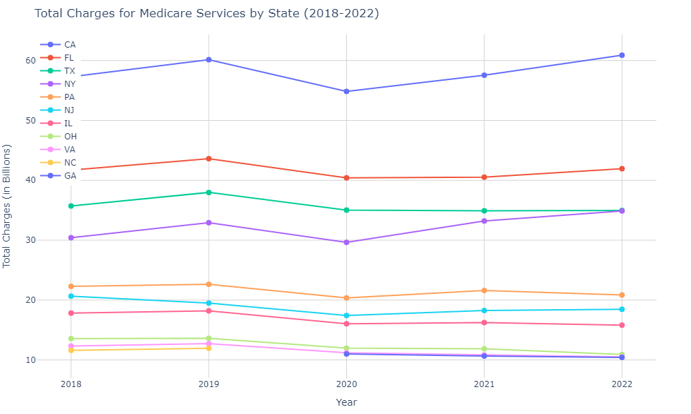
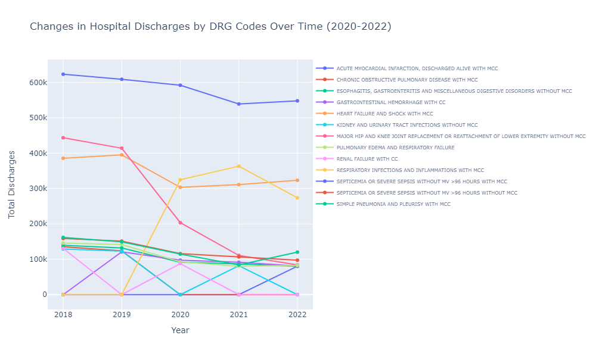

# Medicare_Data_Analysis

## Introduction

The Centers for Medicare and Medicaid Services (CMS) provides extensive data on healthcare services, charges, and payments in the United States. This analysis focuses on inpatient provider charge data from 2018 to 2022. The goal is to uncover trends, identify key cost drivers, and highlight variations across states and hospitals. Understanding these patterns can inform policy decisions, improve cost management, and enhance healthcare delivery.

The key objectives of the analysis include the following:
- Determine the total charges, Medicare payments, and total payments across the USA and each state from 2018 to 2022
- Identify which DRGs incur the highest Medicare costs
- Discover the most common hospital discharges and their trends over the years
- Examine the trends in charges, payments, and discharges over the last three years
- Identify states and hospitals with the highest charges and payments

## Data Analysis

1. **Data Integration, Cleaning and Preparation:** Consolidating inpatient provider datasets for multiple years (2018-2022) from Centers for Medicare and Medicaid Services (CMS),  involved meticulous data cleaning and preparation to ensure consistency and reliability.

2. **Exploratory Data Analysis (EDA):** Leveraging advanced statistical techniques and visualization of python, the analysis began with exploratory insights into hospital charges, Medicare payments, and discharge trends. Key steps included grouping and aggregating data to identify states and hospitals with the highest charges and Medicare reimbursements, visualizing trends in patient discharges across different conditions and hospital types.

## Key Insights and Recommendations

1. **High-Cost Providers:** Significant variations were observed in hospital charges and Medicare payments between states. For example, states like California and New York consistently showed higher costs compared to others. Hospitals like Cedars-Sinai Medical Center and New York-Presbyterian Hospital consistently top the charts in terms of total charges and Medicare payments. Recommendations include optimizing resource utilization and cost-effective practices without compromising patient care.

2. **Impact of DRG Codes:** Diagnosis-Related Group (DRG) codes such as severe sepsis and major joint replacements incur substantial costs. Insights into these areas suggest targeted interventions to manage costs and improve outcomes.

3. **Patient Discharge Trends:** Hospitals vary significantly in patient throughput, highlighting the need for tailored strategies in capacity planning and patient flow management.

 

## Recommendations:

- Operational Efficiency: Implementing data-driven strategies to enhance operational efficiency and reduce costs.
- Patient Care Optimization: Leveraging predictive analytics to personalize patient care and reduce readmission rates.
- Policy Implications: Informing healthcare policies based on insights into healthcare utilization and cost patterns.

## Conclusion
In conclusion, this project underscores the transformative potential of data analytics in healthcare. By dissecting complex datasets and extracting actionable insights, it illuminates pathways for enhancing healthcare delivery, optimizing resource allocation, and improving patient outcomes. As healthcare continues to evolve, leveraging data-driven approaches will be integral in shaping a more efficient and patient-centric healthcare ecosystem.
